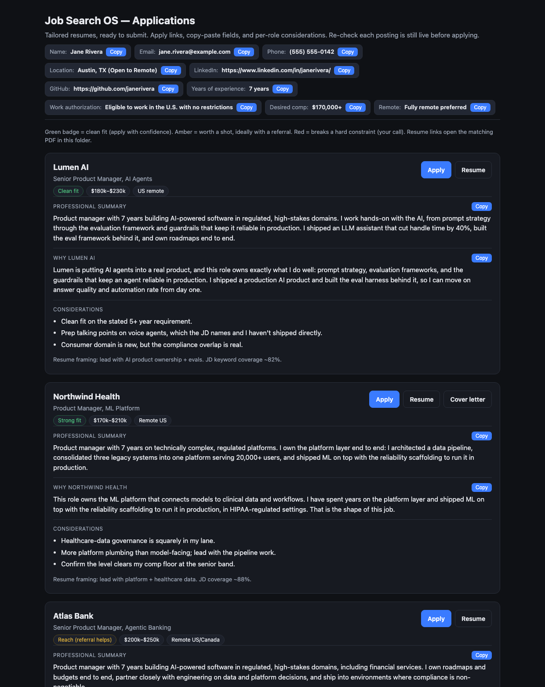

# Job Search OS

A file-based, agentic job-search pipeline you run with Claude Code. It sources real
roles, tailors a 1-page resume in an exact format grounded only in your evidence
ledger, renders it to PDF, and tracks every application in a single dashboard. It is
not a content generator; it is a system for producing credible, verifiable applications
and good referral coverage with a human in the loop on everything that gets sent.

The output you actually work from is a single HTML dashboard. One card per role, each
with the apply link, the tailored resume, copy-paste application fields, and a short
considerations note. Applying becomes review-and-click.



## Philosophy

Modern hiring is an adversarial environment: an ATS, an AI-text detector, and an
upstream verification stack sit between you and a human. This system is designed
around that reality.

- **Recruiter-side AI is the adversary.** Over-polished text is now a negative signal,
  and proprietary-tool name-dropping gets flagged as fraud. The goal is credible,
  specific signal, not eloquence or volume.
- **Zero fabrication via an evidence ledger.** Every claim on every resume traces to an
  entry in `profile/evidence-ledger.md` with a verifiable source. If a job description
  wants something the ledger lacks, that surfaces as a gap, not an invention. A claim
  that fails a reference or skills check is worse than no application.
- **Exact-format 1-page resumes.** Resumes are generated by a single rendering engine
  (`scripts/render_resumes.py`) that always produces the same clean, machine-readable,
  one-page layout. You never hand-format a PDF.
- **Referral-first scoring.** Referred candidates interview at far higher rates than
  cold applicants, so network reachability is an input to how roles are ranked. Network
  discovery is human-assisted only; the system never scrapes LinkedIn.
- **The eval/improve loop.** Fit scores are falsifiable predictions logged against real
  callback data, and interview debriefs become labeled data for the next round of prep.
- **Human gates on sending.** Drafting is automatic; sending is not. The system prepares
  files and a dashboard, and you submit.

## Prerequisites

- **Claude Code** (this repo is driven by the bundled skill).
- **A Chromium/Chrome** install for HTML-to-PDF rendering. The render script auto-detects
  common locations; override with the `CHROME` environment variable if yours differs.
- **Python 3** with `pyyaml` and `pypdf`:
  ```bash
  pip install pyyaml pypdf
  ```
- Optional, for automated GREEN-source scraping: the Antigravity CLI + Firecrawl
  (`scripts/scrape.sh`). You can also just paste job descriptions in by hand.

## Setup

1. **Clone the repo** somewhere you want your job search to live.
   ```bash
   git clone <your-fork-url> job-search-os && cd job-search-os
   pip install pyyaml pypdf
   ```

2. **Install the skill** so Claude Code can run the pipeline:
   ```bash
   mkdir -p ~/.claude/skills/job-search-os
   cp skill/SKILL.md ~/.claude/skills/job-search-os/SKILL.md
   ```

3. **Fill in your profile.** These three files are the heart of the system:
   - `profile/evidence-ledger.md` — every accomplishment you might put on a resume, with
     exact metrics and how each is verifiable. Nothing reaches a resume unless it is here.
   - `profile/constraints.md` — comp floor, remote/location, target titles, dealbreakers.
   - `profile/voice-sample.md` — 3-5 things you actually wrote, so the critic can detect
     AI-polish drift. Optionally also fill `profile/narrative-arc.md` (your one-sentence
     throughline).

4. **Set your resume header.** Edit the `CONTACT`, `EDUCATION`, the bullet bank `B`, and
   the `ADDITIONAL` block at the top of `scripts/render_resumes.py`. Confirm the example
   still renders to one page:
   ```bash
   python3 scripts/render_resumes.py example
   python3 -c "from pypdf import PdfReader; print(len(PdfReader('companies/example/example.pdf').pages))"  # 1
   ```

5. **Run the skill in Claude Code** to source roles, tailor resumes, and update the
   dashboard. Copy `templates/dashboard.html` to wherever you keep finished applications
   (e.g. `~/job-applications/Job Applications.html`) and let the skill keep it current.

## File tree

```
.
├── README.md                  # this file
├── CLAUDE.md                  # the orchestrator's standing constitution (rules)
├── DESIGN.md                  # functional + technical design, threat model
├── SPEC.md                    # detailed spec
├── .gitignore
├── profile/
│   ├── evidence-ledger.md     # source of truth: every claim traces here (zero fabrication)
│   ├── constraints.md         # hard filters: comp, remote, titles, dealbreakers
│   ├── voice-sample.md        # your real writing, for the authenticity critic
│   └── narrative-arc.md       # your one-sentence throughline + supporting threads
├── pipeline/
│   ├── app-tracker.md         # YAML state machine for every role
│   └── scoring-weights.yaml   # fit-score weights (incl. referral reachability)
├── interviews/
│   └── interview-history.md   # debriefs become labeled data for the eval loop
├── scripts/
│   ├── render_resumes.py      # the 1-page resume rendering engine (HTML -> PDF)
│   ├── calibrate.py           # grade past fit-score predictions against outcomes
│   └── scrape.sh              # GREEN-source scraping wrappers (Firecrawl/Antigravity)
├── sub-agents/
│   ├── company-intel-agent.md # builds the per-company dossier
│   ├── referral-mapper.md     # maps warm paths into target companies
│   ├── resume-composer.md     # composes ledger-grounded resumes
│   └── authenticity-critic.md # adversarially red-teams every artifact pre-human
├── context-library/
│   └── domain-glossary.md     # shared vocabulary for tailoring
├── templates/
│   └── dashboard.html         # the application dashboard (copy buttons, apply links)
├── skill/
│   └── SKILL.md               # the Claude Code skill (install into ~/.claude/skills/)
└── companies/                 # per-role working dirs (created as you apply)
    └── example/               # the example render output
```

## How it works (per pipeline stage)

1. **Source.** The skill fans out subagents across GREEN channels (career pages, ATS-hosted
   JDs on Greenhouse/Lever/Ashby/Workday, remote boards) and returns only real, currently-live
   roles with working URLs, confirmed comp/remote where possible, and honest fit gaps. RED
   sources (LinkedIn, login-walled sites) are never scraped automatically.
2. **Score.** Roles are ranked on requirement coverage, domain fit, seniority, and referral
   reachability (`pipeline/scoring-weights.yaml`). Scores are predictions, logged in
   `pipeline/app-tracker.md` for later grading by `scripts/calibrate.py`.
3. **Intel.** For a role you choose to pursue, `company-intel-agent` builds a dossier and
   `referral-mapper` looks for warm paths (human-assisted).
4. **Compose.** `resume-composer` writes a tailored summary and selects which experiences to
   surface, drawing only from the evidence ledger, then `scripts/render_resumes.py` renders a
   one-page PDF in the exact format.
5. **Critique.** `authenticity-critic` red-teams the artifact the way the opposing AI would,
   checking for fabrication and AI tells, before any human sees it.
6. **Track + send.** The role lands on the dashboard (`templates/dashboard.html`) with apply
   links and copy-paste fields. You review and submit. Sending is always human-gated.
7. **Learn.** After interviews, debriefs go in `interviews/interview-history.md`; callback data
   grades the earlier fit-score predictions, and both feed the next cycle.

## A note on honesty

The whole system is built to make fabrication structurally hard, not just discouraged. Keep
your evidence ledger accurate, including an honest record of what you have not done. The point
is to apply to the right roles with claims you can defend in the interview room.
